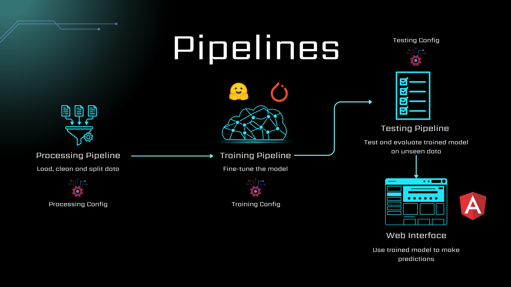

# Fine-Tuning a Text-to-Text Model on a Financial Question Answering Dataset

This project demonstrates how to fine-tune a text-to-text model on a financial question answering dataset using the Hugging Face Transformers library for training and evaluation. It provides a fully customizable pipeline for:

- Data preprocessing  
- Model fine-tuning  
- Evaluation  

Model inference is served through a full-stack web application built with **Flask** (backend) and **Angular** (frontend).


---

### Why [T5](https://huggingface.co/docs/transformers/model_doc/t5)?

The **T5 (Text-to-Text Transfer Transformer)** architecture is chosen for its effectiveness in generative question answering tasks, where answers must be generated in natural language rather than extracted verbatim from the context.

- **Encoder-only models** (e.g., BERT) are limited to extractive QA, where the answer is selected as a span from the context. They are unsuitable for tasks requiring generation or rephrasing.
- **Decoder-only models** (e.g., GPT, Phi-3) support generative QA but often require:
  - Additional setup (e.g., [Ollama](https://ollama.com/) provider locally)  
  - Paid API access (e.g., Hugging Face Inference Endpoints, OpenRouter).

T5 is a **sequence-to-sequence model** (encoder-decoder) that combines strong comprehension (via the encoder) with flexible generation (via the decoder). This makes it ideal for tasks that demand coherent and contextually relevant natural language output.

---

### Dataset Use

The financial dataset is used only for demonstration purposes. The pipeline is designed to be adaptable to any question answering domain. Users can replace the dataset and adjust preprocessing steps accordingly. Many interesting applications can be explored, such as:
- **Medical QA:** Answering clinical or biomedical questions from papers or patient data.
- **Company Reports QA:** Extracting insights from financial statements or investor materials.
- **Legal Document QA:**  Providing answers from contracts, legislation, or case law.
- **Educational QA:** Building intelligent tutors from textbooks or lecture notes.

---

## Pipelines Overview

### Data Preprocessing ([src/preprocessing_pipeline.py](src/preprocessing_pipeline.py))
*Configurable via:* [config/preprocessing_config.json](config/preprocessing_config.json)

- Load raw data, remove NaN and irrelevant entries.  
- Split into training, validation, and test sets.  
- Save processed datasets for later stages.

### Training ([src/training_pipeline.py](src/training_pipeline.py)) 
*Configurable via:* [config/training_config.json](config/training_config.json)

- Load configuration and initialize model, optimizer, and device.  
- Fine-tune the model on training data.  
- Save the best model based on validation loss.

### Testing ([src/testing_pipeline.py](src/testing_pipeline.py))
*Configurable via:* [config/testing_config.json](config/testing_config.json)

- Load the best trained model.  
- Predict on the test set.  
- Evaluate with **BLEU** and **ROUGE** metrics.

### Inference via Web Application

- Allows users to input a context and question and receive an answer generated by the fine-tuned model.

Example:
- **Context:** As of 2023, Apple's revenue reached 400 billion dollars, with major product lines such as the iPhone, iPad, Mac computers, and services like the App Store and iCloud. Apple has a market capitalization of over 2.5 trillion dollars, making it the most valuable company globally.
- **Question:** What are Apple's major products?
- **Answer:** Apple's major products include the iPhone, iPad, Mac computers, and services like the App Store and iCloud.


<div style="text-align: center;">
    
</div>

---

## Getting Started

### Prerequisites

Install the following:

- [Python](http://python.org/downloads/)
- [Node.js](https://nodejs.org/en/download)
- [Angular CLI](https://angular.dev/tools/cli)

### Installation

1. Clone the repository:
    ```bash
    git clone https://github.com/Lahdhirim/financial_question_answering_tool.git
    cd financial_question_answering_tool
    ```

2. Install dependencies:

    - Python:
        ```bash
        pip install -r requirements.txt
        ```

    - Angular (UI):
        ```bash
        cd src/web_app/angular_ui
        npm install
        ```

---

## Running the Pipelines

There are four main execution modes, recommended in the following order:

### Preprocess the Data
```bash
python main.py process_data
```

### Run the Training Pipeline (Mandatory to find the best model)
```bash
python main.py train
```

### Run the Testing Pipeline
```bash
python main.py test
```

### Run the Web Application
```bash
python main.py inference
```
---